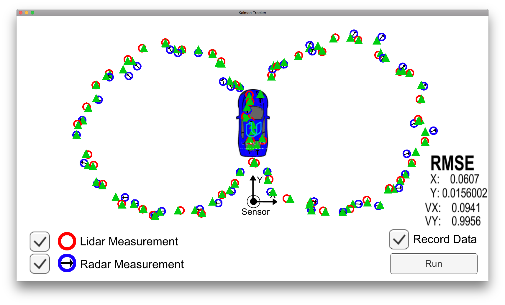
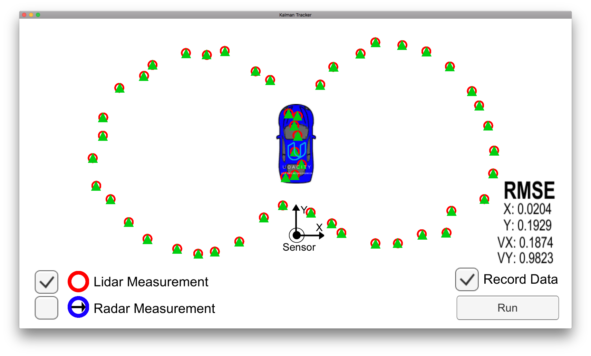
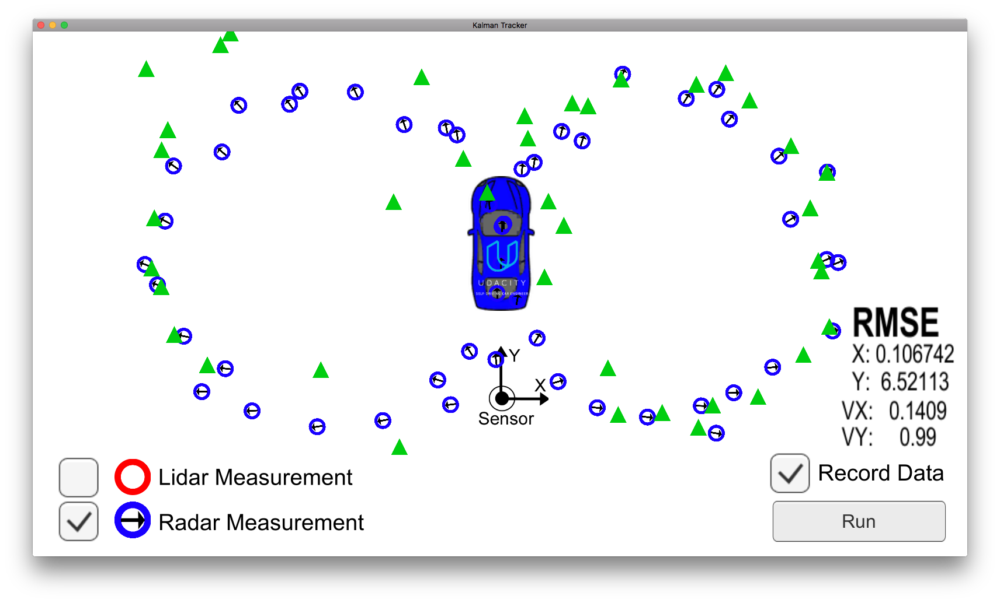

# Extended Kalman Filter Project #

This project is originally forked from https://github.com/udacity/CarND-Extended-Kalman-Filter-Project.  This repository includes starter code, that is used herein.

## Initialization ##

There are two possibilities for initializing the state estimate, depending on which sensor provides a measurement first.

### Lidar Measurement Initialization ###

If the first available measurement comes from the lidar sensor, then the initialization is simple.  We simply take the measured `x` and `y` positions as the initial values for `px` and `py`, and assume `vx` and `vy` are initially `0.0`.

From Constructor function in class KalmanFilter kalman_filter.cpp:
```C++
x_ = VectorXd(4);
x_ << 1, 1, 0, 0;
```

From FusionEKF.cpp:

```C++
else if (measurement_pack.sensor_type_ == MeasurementPackage::LASER) {
        ekf_.x_(0) = measurement_pack.raw_measurements_(0);
        ekf_.x_(1) = measurement_pack.raw_measurements_(1);
        previous_timestamp_ = measurement_pack.timestamp_;
    }
```

### Radar Measurement Initialization ###

If the first available measurement comes from the radar sensors, then we need to convert the polar coordinates `rho` and `phi` into Cartesian coordinates.  Unfortunately, we don't know the direction of `rho_dot`, so we can't use this information to initialize `vx` or `vy`.  Like the lidar case, we assume `vx` and `vy` are initially `0.0`.

From tools.cpp
```C++
VectorXd Tools::Polar2Cartesian(const VectorXd& radar_meas) {
    /**
     * Convert polar coordinates to Cartesian.
     */
    VectorXd f_x(4,1);
    f_x << 1,1,0,0;
    
    // From Lesson 14
    
    float rho = radar_meas(0);
    float phi = radar_meas(1);
    //float rho_dot = radar_meas(2);
    
    f_x << rho*cos(phi),
           -rho*sin(phi),
           0, //unknown how to break rho_dot into vx and vy components
           0;
    
    return f_x;
}
```

From FusionEKF.cpp:

```C++
if (measurement_pack.sensor_type_ == MeasurementPackage::RADAR) {
        ekf_.x_ = tools.Polar2Cartesian(measurement_pack.raw_measurements_);
        previous_timestamp_ = measurement_pack.timestamp_;
    }
```

## Jacobian and Predicted Measurement ##
For radar measurements, we have a nonlinear function `h(x)` to map Cartesian coordinates `px`, `py`, `vx`, `vy` into an estimated measurement in polar coordinates.

In order to update the Kalman filter `K` matrix, we need a linear approximation of `h(x)`, i.e. the Jacobian calculated at point `x`.  The Kalman filter update equations are written only for linear systems.  The Jacobian calculation is illustrated below.

From tools.cpp

```C++
MatrixXd Tools::CalculateJacobian(const VectorXd& x_state) {
    MatrixXd Jacobian(3,4);
    Jacobian << 0,0,0,0,
                0,0,0,0,
                0,0,0,0;
    
    // From Lesson 17
    
    float px = x_state(0);
    float py = x_state(1);
    float vx = x_state(2);
    float vy = x_state(3);
    float c2 = px*px+py*py;
    float c1 = sqrt(c2);
    float c3 = c1*c2;
    
    if (c2 == 0){
        std::cout << "CalculateJacobian() Error - Division by zero";
        return Jacobian;
    }
    else {
        Jacobian << px/c1, py/c1, 0, 0,
        -py/c2, px/c2, 0, 0,
        py*(vx*py-vy*px)/c3, px*(-vx*py+vy*px)/c3, px/c1, py/c1;
    }
    
    return Jacobian;
}
```

In order to calculate the predicted measurement, we use the original nonlinear function, as there is no need to simplify to a linear function.  The nonlinear funciton `h(x)` is illustrated below.

From tools.cpp:

```C++
VectorXd Tools::Cartesian2Polar(const VectorXd& x_state) {
    /**
     * Convert cartesian coordinates to polar.
     */
    VectorXd h_x(3,1);
    h_x << 1,0,0;
    
    // From Lesson 14
    
    float px = x_state(0);
    float py = x_state(1);
    float vx = x_state(2);
    float vy = x_state(3);
    float c1 = sqrt(px*px+py*py);
    
    if ((px == 0)||(c1==0)){
        std::cout << "Cartesian2Polar Error - Division by zero";
        return h_x;
    }
    else {
        h_x << c1,
               atan2(py, px),
               (vx*px+vy*py)/c1;
    }
    
    return h_x;
}
```

## Predict Step ##
The predict step is quite simple.  The `F` and `Q` matrices are updated based on the current measurement timestamp, and `x'` and `P` are calculated accordingly.

From FusionEKF.cpp
```C++
  // Update F and Q matrices, calculate x'
  float dt, dt2, dt3, dt4;
  dt = 0.000001*(measurement_pack.timestamp_ - previous_timestamp_);
  dt2 = dt*dt;
  dt3 = dt2*dt/2;
  dt4 = dt3*dt/2;
  
  float noise_ax, noise_ay;
  noise_ax = 9;
  noise_ay = 9;
  previous_timestamp_ = measurement_pack.timestamp_;

  ekf_.F_ << 1, 0, dt, 0,
             0, 1, 0, dt,
             0, 0, 1, 0,
             0, 0, 0, 1;
  
  ekf_.Q_ << dt4*noise_ax, 0, dt3*noise_ax, 0,
             0, dt4*noise_ay, 0, dt3*noise_ay,
             dt3*noise_ax, 0, dt2*noise_ax, 0,
             0, dt3*noise_ay, 0, dt2*noise_ay;
    
  ekf_.Predict();
```

From kalman_filter.cpp
```C++
void KalmanFilter::Predict() {
    // From Lesson 11
    x_ = F_*x_;
    MatrixXd Ft = F_.transpose();
    P_ = F_ * P_ * Ft + Q_;
}
```

## Update Step ##
The update step is dependent on the measurement type: radar or lidar.  The differences are as follows:
1. For the radar case, calculate `z_pred` using the nonlinear function `h(x)`, for the lidar case use `H` matrix
2. For the radar case, calculate `K` using the Jacobian, for the lidar case use the `H` matrix
3. For the radar case, the measurement covariance matrix is 3x3, for the lidar case it is 2x2

The relevant code is shown below.

From FusionEKF.cpp
```C++

//measurement covariance matrix - laser
R_laser_ << 0.0225, 0,
            0, 0.0225;

//measurement covariance matrix - radar
R_radar_ << 0.09, 0, 0,
            0, 0.0009, 0,
            0, 0, 0.09;

if (measurement_pack.sensor_type_ == MeasurementPackage::RADAR) {
    // Radar updates
    ekf_.R_ = R_radar_;
    ekf_.H_ = MatrixXd(3,4);
    ekf_.H_ = tools.CalculateJacobian(ekf_.x_);
    ekf_.UpdateEKF(measurement_pack.raw_measurements_);
  } else {
    // Laser updates
    ekf_.R_ = R_laser_;
    ekf_.H_ = MatrixXd(2,4);
    ekf_.H_ << 1, 0, 0, 0,
               0, 1, 0, 0;
    ekf_.Update(measurement_pack.raw_measurements_);
  }
```

From kalman_filter.cpp
```C++
// Lidar update
void KalmanFilter::Update(const VectorXd &z) {
    // From Lesson 11
    VectorXd z_pred = H_ * x_;
    VectorXd y = z - z_pred;
    MatrixXd Ht = H_.transpose();
    MatrixXd S = H_ * P_ * Ht + R_;
    MatrixXd K = P_ * Ht * S.inverse();
    
    //new estimate
    x_ = x_ + (K * y);
    long x_size = x_.size();
    MatrixXd I = MatrixXd::Identity(x_size, x_size);
    P_ = (I - K * H_) * P_;
}

// Radar update
void KalmanFilter::UpdateEKF(const VectorXd &z) {
  // From Lesson 20
  Tools tool;
  // Use nonlinear prediction, not Jacobian
  VectorXd z_pred = tool.Cartesian2Polar(x_);
  VectorXd y = z - z_pred;
  MatrixXd Ht = H_.transpose();
  MatrixXd S = H_ * P_ * Ht + R_;
  MatrixXd K = P_ * Ht * S.inverse();
    
  //new estimate
  x_ = x_ + (K * y);
  long x_size = x_.size();
  MatrixXd I = MatrixXd::Identity(x_size, x_size);
  P_ = (I - K * H_) * P_;
}
```

## Performance ##
Two datafiles are provided to evaluate the accuracy for the final EKF.
1. [sample-laser-radar-measurement-data-1.txt](data/sample-laser-radar-measurement-data-1.txt)
2. [sample-laser-radar-measurement-data-2.txt](data/sample-laser-radar-measurement-data-2.txt)

RMSE is calculated as shown below.

From tools.cpp
```C++
VectorXd Tools::CalculateRMSE(const vector<VectorXd> &estimations,
                              const vector<VectorXd> &ground_truth) {
    VectorXd rmse(4);
    rmse << 0,0,0,0;
    
    // From Lesson 21
    
    if (estimations.size() != ground_truth.size()){
        std::cout << "Array sizes must match!";
        return rmse;
    }
    else if (estimations.size() == 0){
        std::cout << "Arrays must be non-empty!";
        return rmse;
    }
    
    //accumulate squared residuals
    for(int i=0; i < estimations.size(); ++i){
        // ... your code here
        VectorXd tmp = estimations[i]-ground_truth[i];
        tmp = tmp.array()*tmp.array();
        rmse += tmp;
        
    }
    
    //calculate the mean
    rmse = rmse/estimations.size();
    
    //calculate the squared root
    rmse = rmse.array().sqrt();
    
    return rmse;
}
```

My EKF implementation satisfies the rubric accuracy criteria for both datasets.

#### RMSE for sample-laser-radar-measurement-data-1.txt ####
|State                 |RMSE Actual       |RMSE Limit                     
|:------------------------------|:------------------|:------|:--
|`px`|0.065   |0.08    
|`py`  |0.062 |0.08        
|`vx`            |0.544 |0.60        
|`vy`|0.544 |0.60    

## Performance Visualization ##
Udacity provides a tool to visualize the performance of the extended Kalman filter, and to calculate the RMSE for a single figure 8 path.  The images below show the performance for cases with both lidar and radar, with lidar only, and with radar only.  It's clear from these results that the overall performance is much better for the combined system, and that the radar by itself is a very poor sensor.

For the case where both sensors are used, RMSE for the y position is 0.016.  For the lidar only case, this is more than 10 times worse: 0.193.  For the radar-only case, this is more than 400 times worse: 6.521.


*Results using both sensors*


*Results using only lidar*


*Results using only radar*
